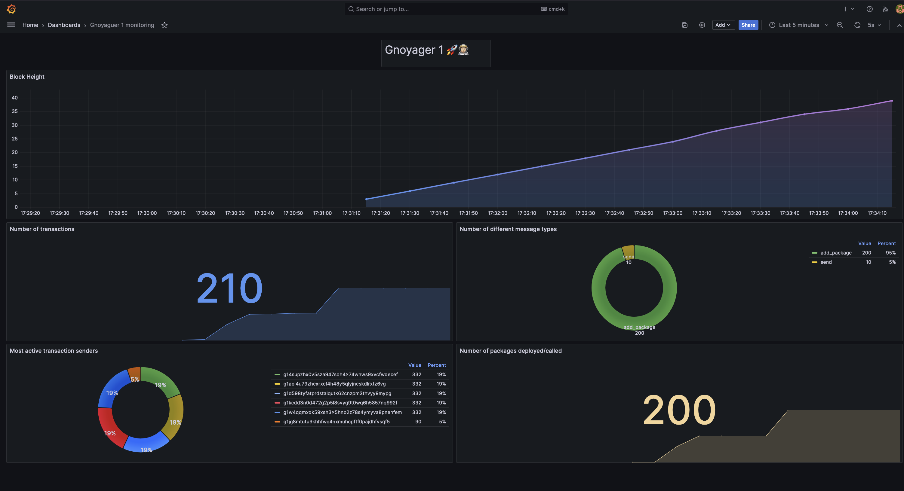

# Gnoyager 1 👨🏼‍🚀🚀

[](LICENSE)

## Description

Gnoyager 1 is a deep space shuttle created with the sole purpose of exploring the wider Cosmos. This tools start the Gno node, tx-indenxer, supernova, collect metrics and present metrics with Grafana.



## Table of Contents

- [Installation](#installation)
- [Usage](#usage)
- [Contributing](#contributing)
- [License](#license)
- [Contact](#contact)

## Installation

```
git clone
cd gnoyager_1
```

## Usage

Docker compose orchestrate all the required services and generate a Grafana dashboard where the Gno blockchain metric data can be seen.

```
docker-compose up
```

Go to http://localhost:3000 and see Gno blockchain metrics.

## Contributing

Feel free to open a ticket if there's a bug or directly raise a PR.

## License

This project is licensed under the [MIT License](LICENSE).

## Contact

- GitHub: [luis02lopez](https://github.com/luis02lopez)


## Services

The project consists of the following services:

- **gno_node**: A service for running the Gno Node. It is built from the `gno` directory using the `Dockerfile.test` file. It exposes ports 26657 and 26656 for communication and performs a health check to ensure it is running properly.

- **gno_indexer**: A service for running the Gno Indexer. It is built from the `tx-indexer` directory using the `Dockerfile.test` file. It exposes port 8546 and depends on the `gno_node` service being healthy.

- **gno_supernova**: A service for running the Gno Supernova. It is built from the `supernova` directory and depends on the `gno_node` service being healthy.

- **gno_monitoring**: A service for monitoring the Gno network. It is built from the `gno_monitoring` directory and exposes port 2112. It depends on the `gno_supernova` and `gno_indexer` services.

- **prometheus**: A service for collecting and storing metrics. It uses the `prom/prometheus` image and exposes port 9090. It depends on the `gno_monitoring` service.

- **grafana**: A service for visualizing metrics. It uses the `grafana/grafana-enterprise` image and exposes port 3000. It depends on the `prometheus` service.

## License

This project is licensed under the [MIT License](LICENSE).